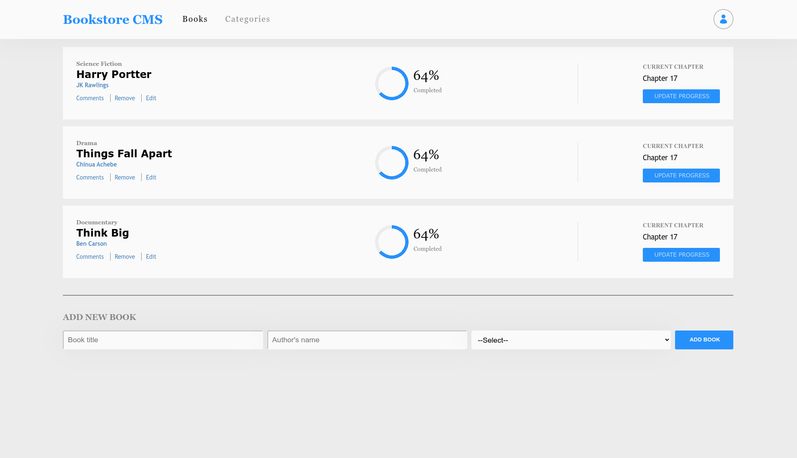

<a name="readme-top"></a>

<div align="center">

  <h3><b>Bookstore</b></h3>

</div>

<!-- TABLE OF CONTENTS -->

# 📗 Table of Contents

- [📖 About the Project](#about-project)
- - [🛠 Built With](#built-with)
    - [Tech Stack](#tech-stack)
    - [Key Features](#key-features)
- [💻 Getting Started](#getting-started)
  - [Setup](#setup)
  - [Prerequisites](#prerequisites)
  - [Install](#install)
  - [Usage](#usage)
  - [Run tests](#run-tests)
- [👥 Author](#author)
- [🔭 Future Features](#future-features)
- [🤝 Contributing](#contributing)
- [⭐️ Show your support](#support)
- [🙏 Acknowledgements](#acknowledgements)
- [📝 License](#license)

<!-- PROJECT DESCRIPTION -->

# 📖 Bookstore <a name="about-project"></a>


**[Bookstore](https://bookstore-dhmd.onrender.com)** is a project that was created inline with the Microverse curriculumn. It is an app that allows the user to manage the progress/status of different books. A user can add, delete, edit, and update books using the app. I used React in this project. 

.

[View project](https://bookstore-dhmd.onrender.com)

.

## 🛠 Built With <a name="built-with"></a>
### Tech Stack <a name="tech-stack"></a>


<details>
  <summary>Client</summary>
  <ul>
    <li>HTML and CSS</li>
    <li><a href="https://reactjs.org/">React</a></li>
  </ul>
</details>

<!-- Key Features -->

.

### Key Features <a name="key-features"></a>
It's main features are: 
- **[Navigation]** 
This allows the users to access the different sections of the app onclick.
- **[Home]**
This is the welcome page that shows the list of books managed in the app.
- **[Form]**
This allows the user to books to the list by keying in the title and author of the book. 
- **[List]**
This shows the list of books added by the user.
- **[Book]**
This shows details about the book and the completed status.


<p align="right">(<a href="#readme-top">back to top</a>)</p>

<!-- GETTING STARTED -->

## 💻 Getting Started <a name="getting-started"></a>

##### To get a local copy up and running, follow these steps.

### Prerequisites <a name="prerequisites" ></>
In order to set up a local copy of this repository, you need to have git installed: 

[Install Git](https://git-scm.com/book/en/v2/Getting-Started-Installing-Git) <a name="install"></a>

### Setup <a name="setup"></a>

Clone this repository to your desired folder:


Example commands:

```sh
  mkdir my-folder
  cd my-folder
  git clone git@github.com:microvese-projects/bookstore-cra.git
  npm install
```
-

### Usage <a name="usage"></a>

To run the project:

  Run 
  ```sh
    npm start
  ```

### Tests <a name="run-tests"></a>
Tests can be performed using the lighthouse extension on google chrome to get a report of the page performance.

<p align="right">(<a href="#readme-top">back to top</a>)</p>

<!-- AUTHORS -->

## 👥 Author <a name="author"></a>

👤 **Benson Njuguna**

- GitHub: [@bennyjoez](https://github.com/bennyjoez)
- Twitter: [@bennyjoezz](https://twitter.com/bennyjoezz)


<p align="right">(<a href="#readme-top">back to top</a>)</p>

<!-- FUTURE FEATURES -->

## 🔭 Future Features <a name="future-features"></a>
I plan to add the following features:

- [ ] **[Categories]**
- [ ] **[ALready_read]**
- [ ] **[Profile]**

<p align="right">(<a href="#readme-top">back to top</a>)</p>

<!-- CONTRIBUTING -->

## 🤝 Contributing <a name="contributing"></a>

Contributions, issues, and feature requests are welcome!

Feel free to check the [issues page](https://github.com/microvese-projects/math-Magicians/issues).

<p align="right">(<a href="#readme-top">back to top</a>)</p>

<!-- SUPPORT -->

## ⭐️ Show your support <a name="support"></a>

If you like this project, you can show your support by giving this project's repository a star on [github](https://github.com/microvese-projects/bookstore-cra/issues). 

<p align="right">(<a href="#readme-top">back to top</a>)</p>

<!-- ACKNOWLEDGEMENTS -->

## 🙏 Acknowledgments <a name="acknowledgements"></a>

I would like to thank Microverse for the outstanding collection of information they have provided that enabled me to create the project.


<!-- LICENSE -->

## 📝 License <a name="license"></a>

This project is [MIT](https://github.com/microvese-projects/bookstore-cra/blob/6235b390e9c060058c83f3d1d67ed9301a1cd70d/LICENSE.md) licensed.

<p align="right">(<a href="#readme-top">back to top</a>)</p>